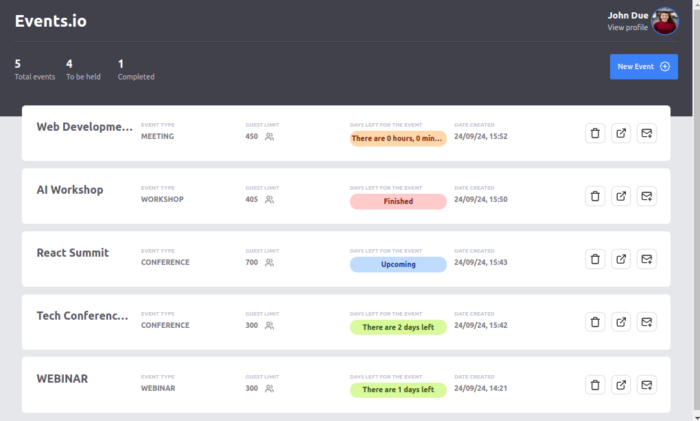
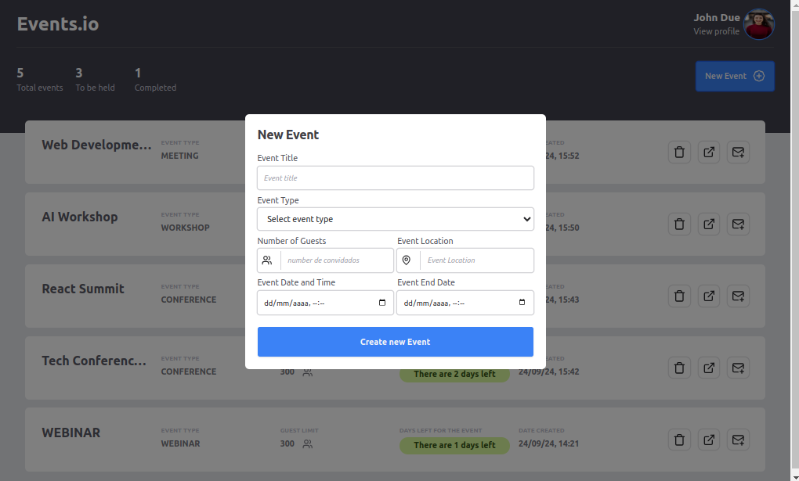

# Project Event.oi




## Descrição

O **Project Event.oi** é uma aplicação web desenvolvida para a criação e gerenciamento de eventos. Com esta aplicação, você pode criar eventos e convidar pessoas para participarem deles via e-mail. A aplicação foi construída utilizando as seguintes tecnologias:

- **React 18**
- **Tailwind CSS**
- **React Router Dom**
- **Vite**
- **TypeScript**

## Funcionalidades

- **Criação de Eventos:** Permite a criação de novos eventos.
- **Envio de Convites:** Envia convites para os convidados via e-mail.
- **Validação de Formulários:** Utiliza o `react-hook-form` para validação dos formulários.
- **Visualização de Dados:** Exibe o total de eventos criados e o total de convidados por evento.
- **Controle de Convites:** Garante que uma pessoa seja convidada apenas uma vez por evento e permite até 3 convidados por convite.

## Instalação e Execução

1. Clone o repositório:
   ```sh
   git clone https://github.com/Amiltonxavier/events
   cd events
   ```
2. Instale as dependências:
  ```sh 
  npm install
  ```
3. Inicie a aplicação:

```sh
    npm run dev
```

5. Acesse a aplicação no navegador:
```sh
    http://localhost:5173
```

# Licença
Este projeto está licenciado sob a MIT License. Veja o arquivo LICENSE para mais detalhes.

Desenvolvido com ❤️ por Amilton Xavier


Sinta-se à vontade para ajustar ou adicionar qualquer informação adicional conforme necessário!