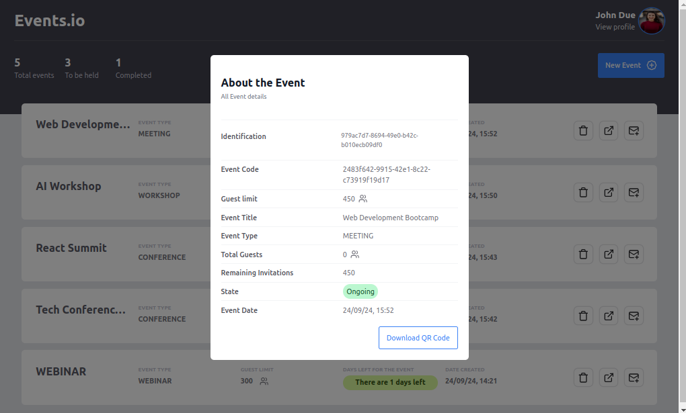

# Project Event.oi

## DEMO

Check out the live demo of the application here:

[Click here to open DEMO](https://events-nine-umber.vercel.app/)


### Dashboard Screen

### Create Event Screen

### Event Details Screen


## Description

**Project Event.oi** is a web application developed for creating and managing events. With this application, you can create events and invite people to participate via email. The application is built using the following technologies:

- **React 18**
- **Tailwind CSS**
- **React Router Dom**
- **Vite**
- **TypeScript**

## Features

- **Event Creation:** Allows the creation of new events.
- **Invitation Sending:** Sends invitations to guests via email.
- **Form Validation:** Uses `react-hook-form` for form validation.
- **Data Display:** Shows the total number of events created and the total number of guests per event.
- **Invitation Control:** Ensures that a person is invited only once per event and allows up to 3 guests per invitation.

## Installation and Execution

1. Clone the repository:
   ```sh
   git clone https://github.com/Amiltonxavier/events
   cd events

 ```

2. Install the dependencies: 
```sh 
  npm install

  ```
3. Start the application:

```sh
    npm run dev
```

4. Access the application in the browser:
```shell
    http://localhost:5173

```

# Licença

This project is licensed under the MIT License. See the LICENSE file for more details.

Developed with ❤️ by Amilton Xavier

This version includes the translated sections and a demo link section, without separating the installation commands or adding extra zones. Let me know if you need any further adjustments!
